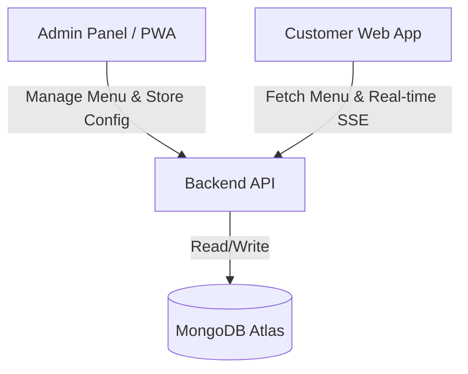

# Swamy Hot Foods - Context & Progress Tracker

This document provides system-wide context for the three repositories of **Swamy Hot Foods** and acts as a living checklist to track our audit status and the implementation of fixes.

---

## 🗺️ System Architecture

### 1. **swamyshotfoods-pwa** (Admin Panel)
- **Port / URL**: `http://localhost:5173` (Vite + React + PWA)
- **Role**: Allows the admin/owner to toggle the open/closed status of the shop, active notices, holiday mode, and perform CRUD operations on the menu items.

### 2. **swamyshotfoods-web** (Customer App)
- **Port / URL**: `http://localhost:3000` (Next.js App Router)
- **Role**: Customer-facing website that displays the interactive menu, shop status, notice board, and streams real-time updates via Server-Sent Events.

### 3. **swamyshotfoods-api** (Backend Layer)
- **Port / URL**: `http://localhost:5001/api` (Express + Mongoose + MongoDB)
- **Role**: Central database connection layer. Handles Authentication, Menu CRUD, Store Configuration, Server-Sent Events (SSE) streaming, and Timing Templates.

---

## 🔍 Context Retrieval Guide

If you or another agent need to understand or modify specific features, here are the key files to read:

| Feature / Domain | API Backend File | PWA (Admin) File | Web (Customer) File |
| :--- | :--- | :--- | :--- |
| **Authentication** | [auth.routes.ts](file:///Volumes/CVS%20Sandisk%201TB%20SkyBlue/Swamy%20Hot%20Foods/swamyshotfoods-api/src/routes/auth.routes.ts) | [useAuthStore.ts](file:///Volumes/CVS%20Sandisk%201TB%20SkyBlue/Swamy%20Hot%20Foods/swamyshotfoods-pwa/src/stores/useAuthStore.ts) | *N/A (Public Facing)* |
| **Menu Items** | [Menu.ts Model](file:///Volumes/CVS%20Sandisk%201TB%20SkyBlue/Swamy%20Hot%20Foods/swamyshotfoods-api/src/models/Menu.ts) | [MenuManagement.tsx](file:///Volumes/CVS%20Sandisk%201TB%20SkyBlue/Swamy%20Hot%20Foods/swamyshotfoods-pwa/src/pages/MenuManagement.tsx) | [menu/page.tsx](file:///Volumes/CVS%20Sandisk%201TB%20SkyBlue/Swamy%20Hot%20Foods/swamyshotfoods-web/app/menu/page.tsx) |
| **Timings & Templates** | [TimingTemplate.ts Model](file:///Volumes/CVS%20Sandisk%201TB%20SkyBlue/Swamy%20Hot%20Foods/swamyshotfoods-api/src/models/TimingTemplate.ts) | *Missing UI (To Be Added)* | [menu-grid.tsx](file:///Volumes/CVS%20Sandisk%201TB%20SkyBlue/Swamy%20Hot%20Foods/swamyshotfoods-web/components/menu/menu-grid.tsx) |
| **Store Status** | [StoreConfig.ts Model](file:///Volumes/CVS%20Sandisk%201TB%20SkyBlue/Swamy%20Hot%20Foods/swamyshotfoods-api/src/models/StoreConfig.ts) | [ShopStatus.tsx](file:///Volumes/CVS%20Sandisk%201TB%20SkyBlue/Swamy%20Hot%20Foods/swamyshotfoods-pwa/src/pages/ShopStatus.tsx) | [page.tsx](file:///Volumes/CVS%20Sandisk%201TB%20SkyBlue/Swamy%20Hot%20Foods/swamyshotfoods-web/app/page.tsx) |
| **Real-time SSE** | [StoreConfigController.ts (sse method)](file:///Volumes/CVS%20Sandisk%201TB%20SkyBlue/Swamy%20Hot%20Foods/swamyshotfoods-api/src/controllers/StoreConfigController.ts) | [useStoreConfigSSE.ts](file:///Volumes/CVS%20Sandisk%201TB%20SkyBlue/Swamy%20Hot%20Foods/swamyshotfoods-pwa/src/hooks/useStoreConfigSSE.ts) | [useStoreConfigSSE.ts](file:///Volumes/CVS%20Sandisk%201TB%20SkyBlue/Swamy%20Hot%20Foods/swamyshotfoods-web/lib/hooks/useStoreConfigSSE.ts) |

---

## 📈 Audit & Sync Progress Tracker

Here is the progress checklist corresponding to the current system audit and proposed synchronization fixes:

### 🛡️ 1. API Security & Integrity
- [x] **Secure User Registration**: Require Admin auth for `POST /api/auth/register` to prevent unauthorized admin creation.
- [x] **Clean Malformed Database Timings**: Convert malformed evening timing strings (e.g. `"4:3pm"`, `"0:00pm"`) to standard 24h `"HH:MM"` (e.g. `"16:30"`, `"20:30"`).
- [x] **Unified Ingredients Schema**: Standardize the ingredients data model and inputs as single comma-separated strings across the PWA/Web clients and Mongoose model.

### 🕒 2. Timing Templates Resolution (Backend)
- [x] **Inject Templates Repository**: Pass the `TimingTemplateRepository` into `MenuService`.
- [x] **Resolve Template Timings**: Program `MenuService` to dynamically resolve timing template properties on retrieval requests (`GET /menu`, `GET /menu/:id`, `GET /menu/available/now`).

### ⚙️ 3. PWA Timing & Customization UI (Admin Panel)
- [x] **Timing Model Inputs**: Add dropdowns to select Predefined Timing Templates and inputs for Custom Morning/Evening timings in `MenuManagement.tsx`.
- [x] **Allergen & Dietary Editor**: Add checkboxes for allergens (dairy, nuts, gluten, soy) and dietary labels (vegan, jain, gluten-free) to Menu Item addition/editing.
- [x] **Admin API Services**: Add API client methods to request templates and update assigned timings.

### 🌐 4. Web Application Global Sync
- [x] **Global Store Status Hook**: Relocate `useStoreConfigSSE()` connection from `page.tsx` to the global `Header` component.
- [x] **Fix Deep Link Inconsistencies**: Ensure direct refreshes on pages like `/menu` load the dynamic store configuration, notice board, and menu footer message.

---

*Last Updated: July 2026*
